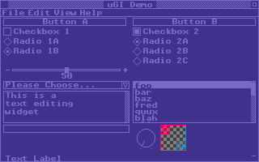

# uGI

micro Graphical Interface

A small C library to create graphical user interfaces (GUI).



## About The Project

## Getting Started

To compile the example program, you need [SDL2][SDL]'s developer package installed on your system.

(The examples use SDL for drawing graphics and receiving operating system events, but uGI is meant to be platform independent and you can use other frameworks or libraries. See the section on the [Driver Program](#driver-program) below)

Use the supplied Makefile to build the demo:

```
$ make
```

Then run the `ugi` program to see the demo:

```
$ ./ugi
```

## Usage

This diagram shows the various aspects of uGI applications:

```
    +-------------------------------+
    |                               |
    |      GUI Application          |
    |                               |
    |                               |
    +-------------------------------+
    |                               |
    |   uGI Library   +----------+  |
    |                 | Widgets  |  |
    |                 +------+---+  |
    |      ^                 |      |
    |      |                 |      |
    +------|-----------------|------+
    |      |                 |      |
    |      |                 v      |
    |  +---+------+  +-----------+  |
    |  | Event    |  | Drawing   |  |
    |  | Handling |  | Functions |  |
    |  +----------+  +-----------+  |
    |                               |
    |        Driver Program         |
    |                               |
    +-------------------------------+
    |                               |
    |       Operating System        |
    |                               |
    |                               |
    +-------------------------------+
```

### GUI Application

The GUI Application is your application that is using uGI to create and manage a graphical user interface.

You will typically call `ugi_start()` to create a new `uDialog` object:

    uDialog *D = ugi_start();

The `uDialog` objects are created on the top of an internal stack. Only the `uDialog` at the top of the stack receives events. This allows pop-up dialog boxes and modal windows. Calls to `ugi_end()` will cause these objects to be popped off the stack, which has the effect of closing the window.

The next step is to add widgets to the dialog through the `ugi_add()` function. For example:

    uWidget *W = ugi_add(D, uw_button, 4, 22, SCREEN_WIDTH/2 - 8, 10);

The first parameter to `ugi_add` is the `uDialog` to which the widget is to be added. The second parameter is a pointer to a _widget function_ that implements the actual widget. These widget functions must match the `ugi_widget_fun` prototype.

The widget function receives messages from the uGI library and processes them. The message types are defined in the `uMessage` enum in `ugi.h`. An example of a message us `UM_DRAW` that tells the widget that uGI wants it to redraw itself. Another example is `UM_CLICK` which is how uGI tells the widget that the user clicked on it.

uGI provides a bunch of common widgets built in, all prefixed with `uw_`. It is possible to create your own widgets by writing a widget function that handles all the events that your widget needs to handle.

It is also possible to extend the behaviour of the built in widgets. For example, to add a custom button you can write a widget function that handles the `UM_DRAW` message to draw the button with a custom graphic and just calls `uw_button()` for all the other messages.

The other parameters to `ugi_add()` is the x,y position and dimensions of the widget.

Widgets may have attributes that the widget function might use to control the widget's appearance or behaviour, or that a GUI application might need.

    uu_set_attr(W, "label", "Button A");

Depending on the widget, it may also need an _action callback_ function that contains a pointer to a function that should be called when the widget is clicked or changed or manipulated (depending on the widget):

    uu_set_action(W, button_callback);

The `button_callback` function in this example must match the `ugi_widget_action` prototype, and will be called when the button is clicked.

### Driver Program

You must first provide a platform dependent driver program that sits between the uGI library and the operating system.

The driver program must implement several functions that uGI will be calling in order to draw widgets on the screen, like `ud_box()` to draw a rectangle on the screen, or `ud_text()` to display text. These functions' names all start with the prefix `ud_`

The driver program must also receive events from the operating system and pass them on to uGI. For example, if the mouse button is clicked, the driver program calls `ugi_click()` with the mouse position, and uGI will make sure that the widget under the mouse cursor receives the mouse click event.

#### Example

The files `sdlmain.c` and `ugiSDL.c` provides a simple example of such a driver program built on top of the [SDL][] library:

* `ugiSDL.c` provides the implementation of all the `ud_` functions.
* It also provides along with a function called `ugisdl_process_event()` that processes SDL events and pass them on to uGI.
* `sdlmain.c` provides a `main()` function that will create a uGI user interface initialise the GUI and run the event loop.
* This particular driver program uses my [bitmap][] module as a framebuffer to draw the graphics to, but you can use any graphics library to draw to the screen.

### uGI Library

The uGI library handles events received from the operating system and uses them to draw the widgets or otherwise interact with them. uGI will call specific `ud_` functions to draw the widgets onto the screen.

[SDL]: https://www.libsdl.org/
[bitmap]: https://github.com/wernsey/bitmap

## License

MIT; See [LICENSE](LICENSE) for details

## Contact

The project's home is at <https://github.com/wernsey/uGI>

## Roadmap

Use the [GitHub issues](https://github.com/wernsey/uGI/issues) page for bug reports and feature requests.

## Acknowledgements

* The main inspiration for this library was [Allegro]'s GUI library (from Allegro 4 - it has been removed in newer versions). The idea to have each widget be a function that processes messages came from there and I borrowed a lot of ideas of what those messages should be from there. Apparently it in turn was inspired by the GEM system on Atari ST computers, but I am not familiar with those.
  * For reference, here is the [GUI routines](https://liballeg.org/stabledocs/en/alleg035.html) section of the Allegro 4 manual.
  * Here is an archived copy of the [Allegro GUI Clinic][allegro-gui] tutorial that helped me understand how it worked back in the old days.
* RXI's [microui] library inspired me to dig up the code for this library again and clean it up. I also liked its API and borrowed some ideas from it. [microui] is a immediate mode GUI library whereas uGI is a retained mode GUI library.

[allegro]: https://liballeg.org/
[allegro-gui]: https://web.archive.org/web/20070830233754/http://agdn.netfirms.com/main/gui/
[microui]: https://github.com/rxi/microui